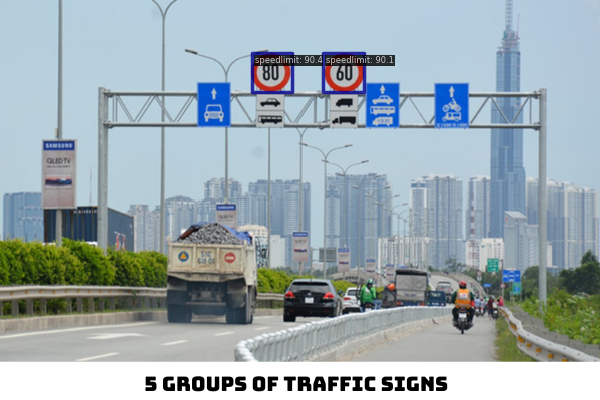

  Download data (Pascal Voc format): <a href = "https://drive.google.com/file/d/1PfL4bkgcveJkMpD4GY6oOcd2b6gDne1R/view?usp=sharing">this</a>

  <ol> 
    <h2>Classes</h2>
    <li>crosswalk</li>
    <li>trafficlight</li>
    <li>speedlimit</li>
    <li>stop</li>
    
  </ol>

  <h2>Getting Started</h2>
  <ol>
    <li>Firstly, clone our git</li>
    <li>cd TrafficSignDetectionYoloX</li>
    <li>Install necessary lib to runcode: 
      <ul>
        <li>pip install -U openmim</li>
        <li>mim install mmengine</li>
        <li>mim install "mmcv>=2.0.0"</li>
        <li>pip install -v -e .</li>
      </ul>
    </li>
    <li>Use convert_to_coco.py to convert data to coco format</li>
    <li>To train: run ' python tools/train.py configs/yolox/yolox_s_8xb8-300e_coco.py'</li>
    <li>To infer: run 'python infer.py [img_url] [image output name if it isn't specify it will have a default name is output]'</li>
    <li>Please checking configs/yolox/yolox_s_8xb8-300e_coco.py if you want to change config</li>
  </ol>

  <h2>Result</h2>
  <h3>Score: bbox_mAP_50: 0.95 </h3>
  
  

